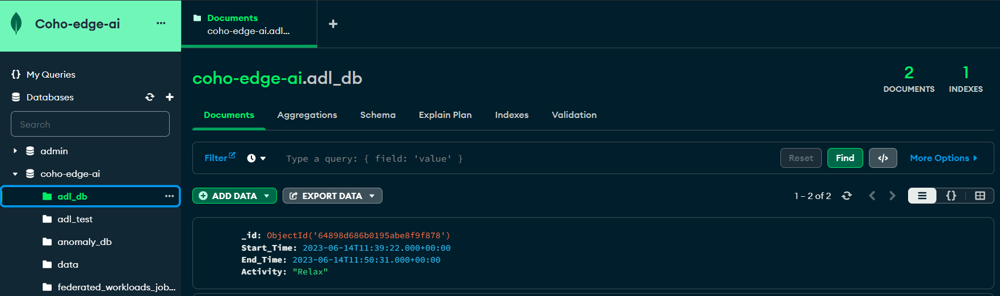
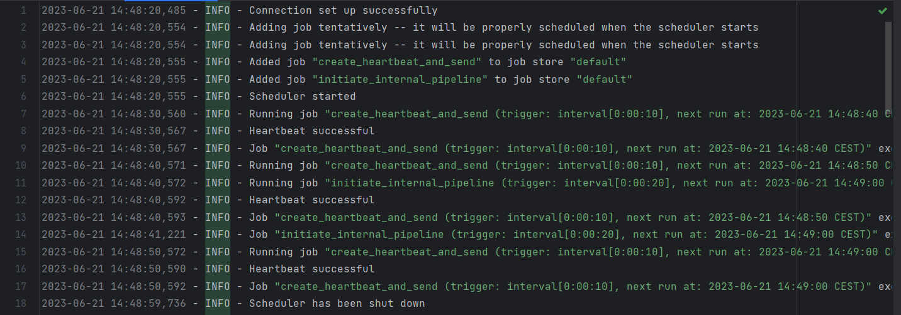

# User Guide

This guide is designed to provide you with the necessary information and instructions to effectively use this system. 
Key features of the system will be explained with tips and visuals, to help you run the application smoothly.

## Sandboxes
The sandboxes are a way to test a few models created by us on a public dataset. They contain the following:
- `data_access`: contains a parser for the public dataset
- `ml_models`: contains the models that will be tested. 
These models have a `train`, `predict`, `save` and `load` method.
- `torch_models`: contains implementations of the deep learning models that inherit from `Torch.nn`
- `preprocessing`: contains the preprocessing steps required before being able to pass the data to the models
(splitting into windows, formatting the windows into the model's input format).
- `validating` / `train_and_eval`: contains a validating method, that trains a model and 
then tests it and returns an accuracy and a confusion matrix.
- `playground`: contains **Jupyter Notebooks** that allow the models to be instantiated, validated, and saved/ loaded.

Important to note that the models were created with customisability in mind. To that extent, the models from `sk-learn`
allow the use of all their parameters from the library. For example the SVM model can be initialised with a `degree`
and a `kernel`. More information about `scikit-learn` can be found [here](https://scikit-learn.org/stable/user_guide.html).
In addition to that, the deep learning models, that use [`PyTorch` library](https://pytorch.org/docs/stable/index.html)
can be initialised with different parameters. They can have different number of layers, as well as different activation
function for the hidden layers and the output layers. For example, an Autoencoder used for anomaly detection can be initialised with:
the following encoder layers sizes: [96,64,32,16], decoder layer sizes: [16,32,64,96], hidden activation function: `nn.ReLU()`,
and output activation function: `nn.Sigmoid()`.

## Client

Since the clients are supposed to be represented by Raspberry Pis, there is not much a user can interact with on this side.
However, the client is supposed to interact with a MongoDB and the server so the functionality of the client can be tested there.

Firstly, the client uses MongoDB to store the sensor data, the sequence of ADLs predicted from the sensor data
as well as the anomalous ADL windows detected.

Secondly, the number of ADLs predicted and anomalies detected is constantly sent to the server in the heartbeat.
See [dashboard](#server-and-dashboard) on how the client info can be visualised.

Finally, the client keeps a log of all it's activity, from setting up the connection with the server,
to the scheduling done by setting up the heartbeat and the prediction sequence at regular intervals of time.

## Server and Dashboard

The server is the central point in the system. Its purpose is to hold and aggregate the global models used
to predict the anomalies, holding all the client information, as well as scheduling the federation rounds.

Once the server is running there some APIs become available, some intended for the client, and some for the dashboard.
For a complete overview of these, check [here](API_DOCS.md).

