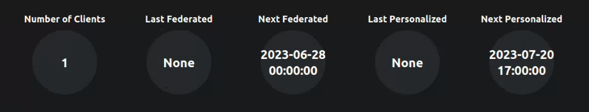
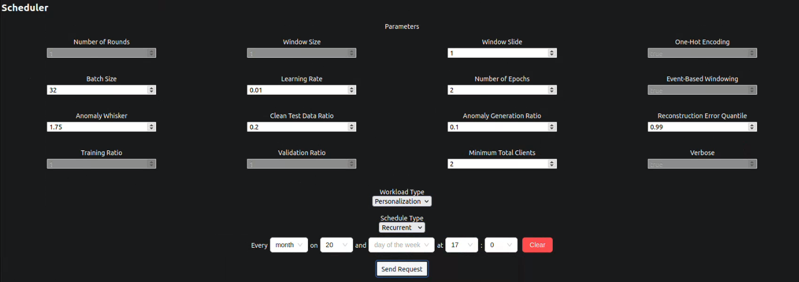
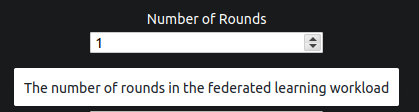
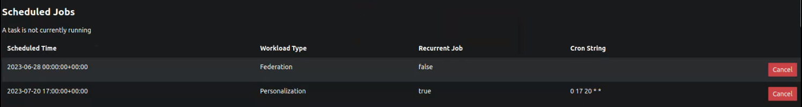
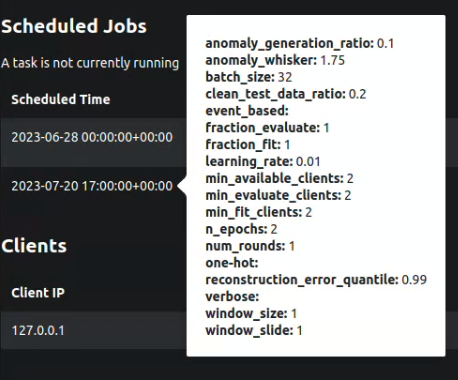
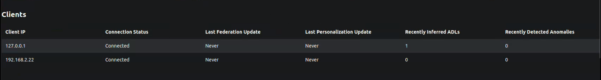
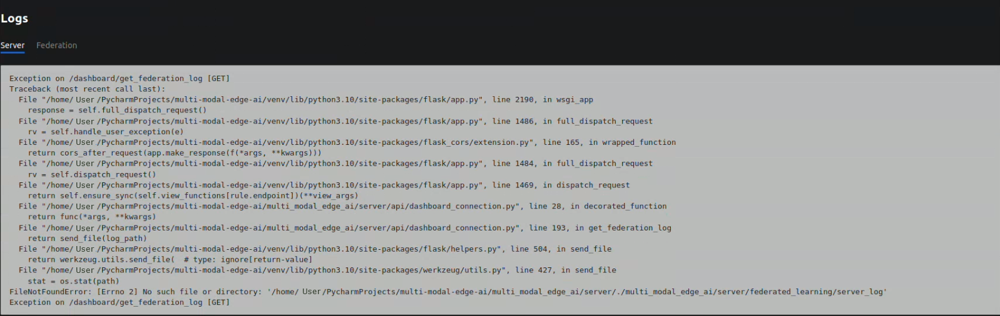
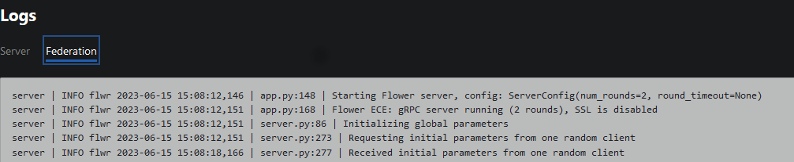

# User Guide

This guide is designed to provide you with the necessary information and instructions to effectively use this system. 
Key features of the system will be explained with tips and visuals, to help you run the application smoothly.

## Sandboxes
The sandboxes are a way to test a few models created by us on a public dataset. They contain the following:
- `data_access`: contains a parser for the public dataset
- `ml_models`: contains the models that will be tested. 
These models have a `train`, `predict`, `save` and `load` method.
- `torch_models`: contains implementations of the deep learning models that inherit from `Torch.nn`
- `preprocessing`: contains the preprocessing steps required before being able to pass the data to the models
(splitting into windows, formatting the windows into the model's input format).
- `validating` / `train_and_eval`: contains a validating method, that trains a model and 
then tests it and returns an accuracy and a confusion matrix.
- `playground`: contains **Jupyter Notebooks** that allow the models to be instantiated, validated, and saved/ loaded.

Important to note that the models were created with customisability in mind. To that extent, the models from `sk-learn`
allow the use of all their parameters from the library. For example the SVM model can be initialised with a `degree`
and a `kernel`. More information about `scikit-learn` can be found [here](https://scikit-learn.org/stable/user_guide.html).
In addition to that, the deep learning models, that use [`PyTorch` library](https://pytorch.org/docs/stable/index.html)
can be initialised with different parameters. They can have different number of layers, as well as different activation
function for the hidden layers and the output layers. For example, an Autoencoder used for anomaly detection can be initialised with:
the following encoder layers sizes: [96,64,32,16], decoder layer sizes: [16,32,64,96], hidden activation function: `nn.ReLU()`,
and output activation function: `nn.Sigmoid()`.

## Client

The client has a few main characteristics:
- *Connection to server*: When the client is first started it sends a `Set up connection` request to the server. The server will then send the `adl_model` and `anomaly_detection_model` for the client to save, load and use.
- *Heartbeat*: After the first connection, a `heartbeat` is scheduled to be sent every 10 seconds to the server. In the heartbeat the client sends the recent number of predictions to the server. In the response, the server can send the models again, if they were updated since the last request from the client. Also, the response contains a flag that indicates if the federation client should be started or not.
- *Internal predictions*: The client will read the sensor data, infer ADLs and store them in `adl_db`, and if the new ADL is different than the previous one (i.e. the previous activity is finished), the number of ADLs predicted is increased, and the anomaly detection stage is run to check for anomalies. If the anomaly detection detects an anomaly it will store the anomalous window in `anomalies_db`. Also, it increases the number of anomalies detected. These number of predictions will then be sent with the next heartbeat to the server, and then reset.
- *Federation*: If the `start_federation_client_flag` is set to true, the client will start the federated client and initiate the federated round. This part is handled by [Flower library](https://flower.dev/docs/)

Since the clients are supposed to be represented by Raspberry Pis, there is not much a user can interact with on this side.
However, the client is supposed to interact with a MongoDB and the server so the functionality of the client can be tested there.

Firstly, the client uses MongoDB to store the sensor data, the sequence of ADLs predicted from the sensor data
as well as the anomalous ADL windows detected.

Secondly, the number of ADLs predicted and anomalies detected is constantly sent to the server in the heartbeat.
See [dashboard](#server-and-dashboard) on how the client info can be visualised.

Finally, the client keeps a log of all it's activity, from setting up the connection with the server,
to the scheduling done by setting up the heartbeat and the prediction sequence at regular intervals of time.

## Server and Dashboard

The server is the central point in the system. It holds information about all the clients that connect to it. Also, it allows the scheduling of federation rounds, where it uses [Flower library](https://flower.dev/docs/) to initiate a federation round. After the round is finished, it aggregates all the models from the selected clients, and aggregates to models into one global one that is stored on the server. This will then be redistributed to all the clients of the system.

Once the server is running there some APIs become available, some intended for the client, and some for the dashboard.
For a complete overview of these, check [here](API_DOCS.md).

The dashboard is the main way a user can interact with the system. It displays information about client information, scheduling federation and personalisation and the server and federated logs.

The top of the dashboard displays simple statistics about the system, like number of clients and the date and time of the next federation round.

Next the dashboard allows the user to schedule new federation or personalisation jobs. The user can schedule the job to run regurarly at fixed times, schedule the job to run once, or to run once imediately.

Also, before scheduling the job, the paramaters for the job can be set. While hovering over a parameter, a info box appears, explaining it.

All the scheduled jobs can be seen in the `Scheduled Jobs` table. This shows the type of job, and if it is a recurent job, including the cron string in that case, or not. Also, it allows the user to cancel scheduled jobs.

In addition to all this information, if the user hovers over a job, a box containing all the parameters appears.

The dashboard also includes a list of the clients, alongside some information for each one. 
- The IP identifies the client.
- The connected status is based on a `last_seen` field stored on the server that is updated after every interaction with the server. If this field is more than 3 hours ago, the client appears is `Disconnected` indicating a malfunction, otherwise it shows `Connected`.
- The `Last Federation/Personalisation Update` shows the last time the client participated in a federation/personalisation round.
- The recent ADLs and anomalies show the number of predictions the client has done for each in the past day. These numbers reset everyday at midnight.

Also, the user is able to see the error logs from the server, and all the federation info logs.

