# API explanations

## Frameworks

*Flask* (version 2.3.2) has been used because it is lightweight, scalable and it has extensive documentation.

For a more detailed explanation, you may want to read https://auth0.com/blog/developing-restful-apis-with-python-and-flask/.

*Postman* has been used to test the APIs.

## Starting the server

In the terminal, navigate to the file where the Flask is called and call `flask --app {name} run` (`flask --app .\API_example.py run` in this case). 

The following should appear:
 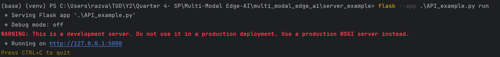

Note that this server should only be used in the development process, and not as a final server. The link from gave some explanation on how to Dockerize the application and be able to run it in the cloud.

To close the server do `Ctrl+C` as instructed in the image.

## GET API example

From Postman, select a GET request, input the URL of the server (also given when first starting the server) and the continuation to the endpoint.

 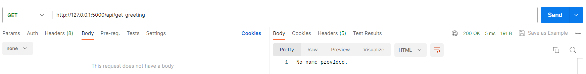

Also, in the example created, a query can be made that takes a `name`:

 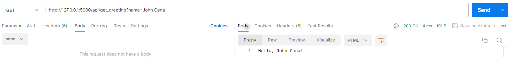

These request also appear in the terminal:

 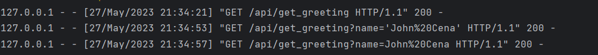

## POST API example

For a POST request, a body is also needed. If no body is provided a 415 is received:

 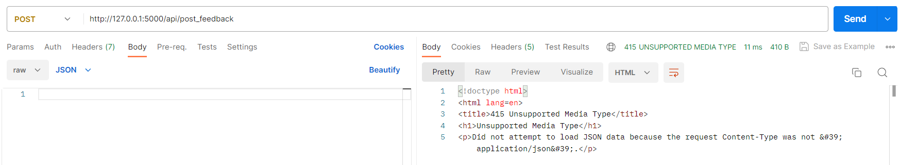
 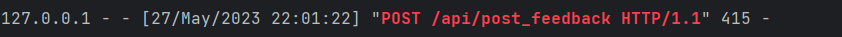
 

However, if a body is provided the request will have a 200 OK code:

 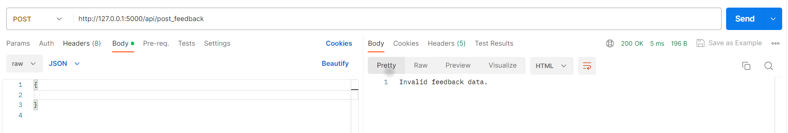
 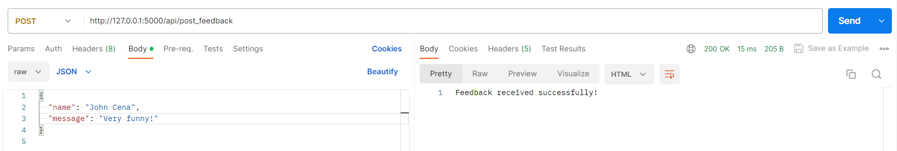

On the server side this will look like this:

 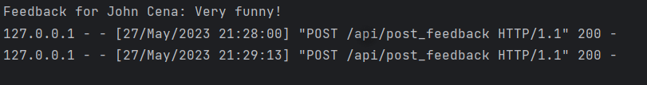

## Non-Existent API example

If an non-existent API is called from POSTMAN:

 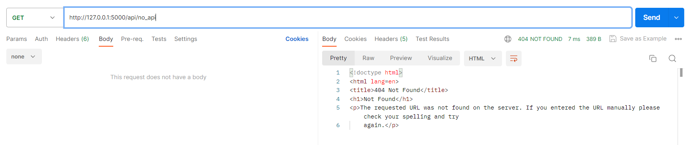

This will also be shown in the terminal:

 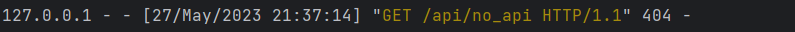

